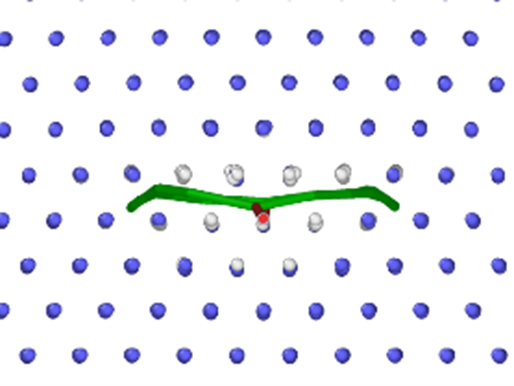

# Follow-Spot-Like Model for Dynamic Dislocation Studies

[](https://doi.org/10.1016/j.msea.2025.148609)
[](./LICENSE)

> **Official code and data repository for:**
>
> **"A follow-spot-like model for dynamic dislocation studies: Application to <111> screw dislocations in B2-NiAl"**
> *Zi Jian Wei, Bai Lin Lü*, Jiang Hua Wu, Tian Xiang Li, Xu Dong Sun, Zhi Zhuo Liu, Jia Bao Shang, Chao Zhao
> *Materials Science & Engineering A 941 (2025) 148609*
> [Link to Paper](https://doi.org/10.1016/j.msea.2025.148609)

---

## 🌟 Overview

This repository provides all the **simulation codes, raw data, analysis scripts, and visualization tools** for the study described in our paper. We propose a **novel follow-spot-like model** that transforms dynamic dislocation motion into a quasi-static process, enabling high-precision and noise-free studies of dislocation dynamics—demonstrated on <111> screw dislocations in B2-NiAl.

**Key features of our approach:**

* **Eliminates interference forces** in the simulation environment, leading to more accurate analysis of dislocation core evolution and motion.
* **Transforms dislocation dynamics** into a sequence of static problems, allowing use of static analysis tools and clearer insight into dislocation mechanisms.
* **Full reproducibility:** All simulation input files, LAMMPS scripts, Python analysis tools, and raw/processed data are included.

## ✨ Scientific Highlights

* **First-of-its-kind "follow-spot" model**: The dislocation line is always aligned with the axis of a cylindrical slab, which dynamically follows the motion of the dislocation—like a spotlight tracking a performer.
* **Mapped dislocation energy surfaces** for <111> screw dislocations in B2-NiAl, revealing nontrivial energy valley positions due to the absence of simulation artifacts.
* **Revealed winding, non-linear dislocation trajectories** under applied <121> glide forces—correcting oversimplified assumptions of straight-line motion.
* **Discovered multiple core configurations**: compact, planar dissociation, and spatial dissociation. Found spatial dissociation is a likely key obstacle to <111> dislocation activation and plasticity in B2-NiAl.
* **Full validation on classical and machine-learning interatomic potentials** for both B2-NiAl and bcc-Fe.

## 🖼️ Main Results


*Dislocation energy surface mapped over a 49×49 grid in the x-z plane.*

![Trajectory of the [-111] screw dislocation](docs/glide_path.tif)
*Winding glide trajectory of a <111> screw dislocation in B2-NiAl.*

(docs/core_structures2.png)(docs/core_structures3.png)
*Dissociation patterns of dislocation core: planar, intersection, and segmented.*

> See the [paper](https://doi.org/10.1016/j.msea.2025.148609) for more detailed figures and scientific discussions.

## 🚀 Getting Started

### 1. Clone the Repository

```bash
git clone https://github.com/ppy17136/Follow-Spot-Like_Model.git
cd Follow-Spot-Like_Model
```

### 2. Environment & Dependencies

* **LAMMPS** (Large-scale Atomic/Molecular Massively Parallel Simulator)
* **Python 3.8+** with:

  * `numpy`
  * `matplotlib`
* **OVITO** for visualization (with the Dislocation Extraction Algorithm - DXA)

> All scripts are included and commented. 

### 3. Workflow

* Prepare initial configurations using provided lattice and dislocation scripts.
* Run LAMMPS simulations to relax the structure for each grid position.
* Analyze results (energy surfaces, Peierls barriers, core structures) using Python scripts.
* Visualize atomic configurations and dislocation cores with OVITO.

### 4. Reproducibility

All key data and results in the paper can be reproduced using the scripts and input files provided. 

---

## 📁 Repository Structure

```
Follow-Spot-Like_Model/
│

```

---

## 📝 Citation

If you use this code, data, or results in your research, **please cite our paper**:

```bibtex
@article{Wei2025FollowSpot,
  title = {A follow-spot-like model for dynamic dislocation studies: Application to <111> screw dislocations in B2-NiAl},
  author = {Wei, Zi Jian and Lü, Bai Lin and Wu, Jiang Hua and Li, Tian Xiang and Sun, Xu Dong and Liu, Zhi Zhuo and Shang, Jia Bao and Zhao, Chao},
  journal = {Materials Science & Engineering A},
  volume = {941},
  pages = {148609},
  year = {2025},
  doi = {10.1016/j.msea.2025.148609}
}
```

---

## 🤝 Contributing & Contact

Questions or want to contribute?
Contact the corresponding author

---

## 📚 Related Links

* [LAMMPS official site](https://lammps.sandia.gov/)
* [OVITO official site](https://www.ovito.org/)
* [Paper on ScienceDirect](https://doi.org/10.1016/j.msea.2025.148609)


---

> **If you find this project useful, please star the repository and share it with your colleagues!**

---


